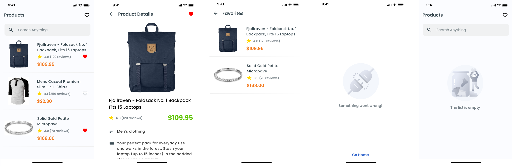

# Desafio Products

## About this Project

The idea of the App is:

Show product list, product details screen and save products as favorites.

## Technologies Used

- Flutter
- Dart
- ValueNotifier
- Clean Architecture
- SharedPreferences
- Dio
- GetIt
- Mockito

## Installation and Usage
To install and use the project, follow these steps:

- Make sure you have the Flutter SDK installed on your development environment.

- Clone this repository to your local environment.

`git clone https://github.com/GiovaneLopes/desafio_products.git`

- Navigate to the project directory.

`cd desafio_products`

- Run the command to fetch the necessary dependencies.

`flutter pub get`

- Start the application on an emulator or connected device.

`flutter run`

- Make sure the emulator or connected device has internet acess.
